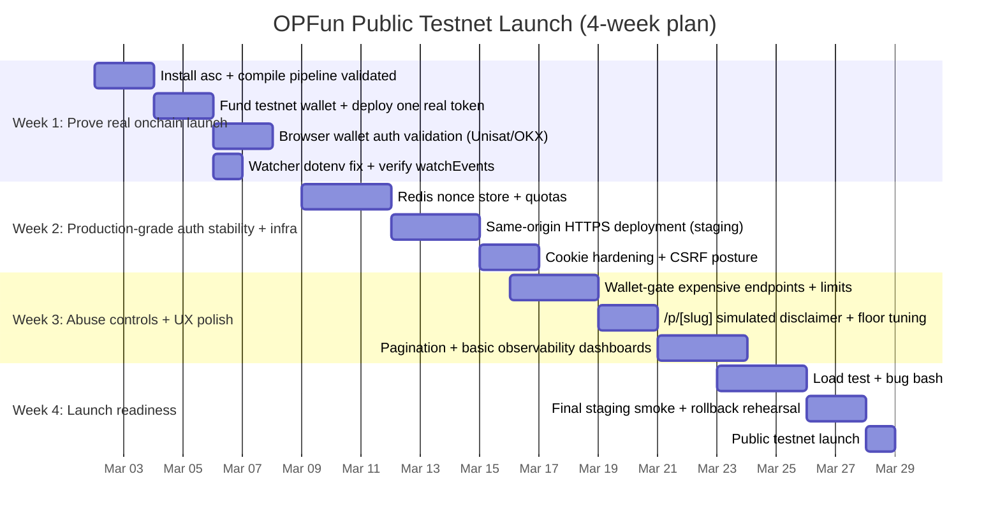
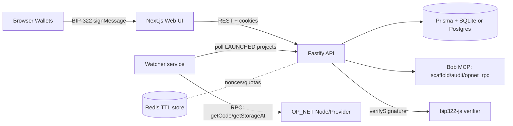

# OPFun Secure Launchpad Public Testnet Launch Roadmap

## Executive summary

OPFun’s current MVP is **functionally complete for a controlled testnet demo**, with key hardening work already applied: BIP‑322 wallet auth, cookie-only sessions, per-route auth rate limits, pledge durability in the DB, runDeploy state-machine guard, and clarity upgrades like the SIM badge and floor layout CSS variable. The latest review reports **all 10 smoke steps pass in a local environment after fixes**, but also shows **three blocking gaps** before a public-facing testnet launch: (a) real compilation via `asc` is not installed, (b) real deployment/broadcasting is not tested and requires funding/mnemonic if using server-broadcast, and (c) real browser wallet signing has not been validated end‑to‑end (Unisat/OKX in a browser). fileciteturn0file0L22-L25 fileciteturn0file0L108-L145

A public-facing testnet launch also needs **production-grade session/nonce durability**, **same-origin HTTPS cookie deployment**, **watcher configurability fixes**, and **abuse controls** (especially around project creation + run-checks) because Bob MCP and deploy steps are expensive and spam-attractive. fileciteturn0file0L150-L172 fileciteturn0file0L191-L201

The recommended 4‑week plan prioritizes:  
1) prove real testnet contract compilation and at least one real onchain launch;  
2) stabilize auth/session and watcher environment behavior for deployments;  
3) deploy with same-origin HTTPS cookies and observability;  
4) add anti-spam and UX polish to make the product safe to share broadly.

## Current inventory and smoke-test evidence

### Build artifacts and “what exists today” checklist

The following artifacts are present and describe the current system state:

| Artifact | Purpose | State |
|---|---|---|
| `MVP_REVIEW.md` | Current QA verdict, smoke results, and prioritization | Present; dated 2026‑03‑02; SHA `a97c31c` fileciteturn0file0L3-L7 |
| `HARDENING_REPORT.md` | Describes the hardening sprint changes (runDeploy guard, BIP‑322 auth flow, pledge DB, UI badges) | Present; includes BIP‑322 flow and PledgeRecord details fileciteturn0file1L11-L109 |
| `TESTNET_SMOKE.md` | Repeatable end‑to‑end smoke test template (env + curl sequence) | Present; **results not filled in** fileciteturn0file2L1-L14 fileciteturn0file2L137-L150 |
| `CHANGELOG_REPORT.md` | Architecture overview, status machine, watcher model, tooling inventory | Present; dated 2026‑03‑01 fileciteturn0file4L1-L7 |

Current functional scope (as reviewed):

- API core flow (create → checks → deploy → launch) is marked complete fileciteturn0file0L14-L17  
- Auth is marked complete with **BIP‑322 + JWT, cookie-only, and rate-limited** fileciteturn0file0L15-L16  
- Web trading floor UI exists (charts/news/avatars/TV monitors/ticker) fileciteturn0file0L19-L21 fileciteturn0file0L88-L92  
- Watcher exists and polls OP_NET RPC via Bob MCP `opnet_rpc` fileciteturn0file0L95-L100  
- Critical missing production prerequisites: **real testnet deploy not tested** (needs `asc` + `OPNET_MNEMONIC` if using server-broadcast) and **real wallet auth not tested** (needs Unisat/OKX in browser). fileciteturn0file0L22-L25

### Smoke-test outputs and pass/fail status

#### What is provided (smoke test summary)

`MVP_REVIEW.md` includes an explicit smoke test results table:

- Create project: **201**  
- Run checks: **202**  
- READY in ~5 seconds  
- Auto-deploy (no mnemonic): **202**, returns PACKAGE_READY → READY  
- Confirm-deploy placeholder: **200**, status LAUNCHED  
- Verify LAUNCHED: **200**, `contractAddress` + `deployTx` set  
- Watcher events: **0** (expected because placeholder address failed bech32m decode)  
- Pledge without cookie: **401**  
- Nonce endpoint: **200**, `{nonce, message, expiresAt}`  
- `/auth/me` without cookie: **401**  
- Rate-limit validated: 10×200 then 429 fileciteturn0file0L31-L47

#### What is not provided (must be marked unspecified)

The `TESTNET_SMOKE.md` template contains a “Flow Results” section but **it is blank** (no recorded outputs, timestamps, or terminal logs). fileciteturn0file2L137-L173

Raw terminal transcripts, screenshots, deployed contract addresses, and txids from a **real** OP_NET broadcast are **not provided**. The review explicitly states “Real testnet deploy: Not tested” and “Real wallet auth: Not tested.” fileciteturn0file0L22-L25

## Security posture and gap analysis

### Wallet authentication correctness and BIP‑322 verification

OP_NET and OP_WALLET ecosystems explicitly support signing messages using BIP‑322 as a selectable message type (vs. default ECDSA), enabling proof of wallet ownership without broadcasting a transaction. citeturn14view0 The BIP‑322 specification defines “legacy, simple, and full” message signature formats, and “simple” signatures are designed for broad interoperability across script types (including SegWit and Taproot-style scripts). citeturn15view0

In OPFun’s implementation (per hardening report), wallet identity is enforced using a challenge-response flow:

- `POST /auth/nonce` returns a nonce + message to sign  
- client signs with `bip322-simple`  
- `POST /auth/verify` verifies signature using `bip322-js` and issues a JWT  
- middleware gates all write routes (pledge/callout/chat/join) fileciteturn0file1L43-L67

This approach is aligned with how OP_NET’s own wallet tooling describes message signing: BIP‑322 signatures are intended for **offchain verification** of wallet ownership. citeturn14view0

#### Library safety and Taproot support

`bip322-js` explicitly documents support for verifying “simple BIP‑322 signatures” on **mainnet/testnet/regtest** and across P2PKH, P2WPKH, P2SH‑P2WPKH, and **single-key-spend P2TR** addresses, exposing `Verifier.verifySignature(address, message, signature)`. citeturn9view0 This is appropriate for Taproot-style addresses that common legacy verifiers cannot validate.

Acceptance-critical implication: OPFun must validate with a real browser wallet signature because the review notes the `/auth/verify` path “has never been exercised with a real wallet signature” and could reject valid wallet outputs. fileciteturn0file0L135-L145

### Nonce lifecycle and replay resistance

OPFun’s nonce model (as documented) includes 5-minute TTL and single-use behavior. fileciteturn0file1L59-L60 That is directionally correct for replay prevention.

However, the current review flags **nonce persistence** as missing: the nonce store is in-memory and resets on API restart, which breaks user auth flows during restarts and makes multi-instance scaling risky. fileciteturn0file0L164-L172

Recommendation for public testnet: persist nonces in **Redis** (with TTL) or a DB table. Redis-based session/nonce TTL is a standard fit for temporary authentication artifacts. citeturn6search22turn6search15

### Cookie-only sessions vs. localStorage

Current posture (from the latest review):  
- “JWT HttpOnly cookie: ✅ No localStorage” and “BIP‑322 wallet auth: ✅ Implemented, cookie-only.” fileciteturn0file0L266-L282

This is the correct direction because cookies marked `HttpOnly` cannot be read by JavaScript, reducing token theft through XSS exfiltration. Cookie hardening should follow modern guidance: include `Secure`, `HttpOnly`, and appropriate `SameSite`; and prefer cookie prefixes like `__Host-` where possible. citeturn7search11turn7search3turn0search5

Concrete cookie requirements for public testnet:

- **HTTPS is mandatory** so `Secure` cookies are actually transmitted and protected in transit. citeturn0search8  
- Prefer `__Host-` prefix for the session cookie (requires Secure, Path `/`, and no Domain attribute), limiting cookie injection and scoping attacks. citeturn7search11turn0search5  
- If any part of the deployment uses cross-site requests, be careful: `SameSite=None` (when needed) increases CSRF exposure and must be paired with CSRF defenses. OWASP’s CSRF guidance emphasizes that SameSite alone is not a complete CSRF defense, and practical bypasses exist. citeturn2search3turn2search15turn2search11

### JWT lifetime and revocation concerns

OPFun currently issues a 24h JWT. fileciteturn0file0L72-L74 This is acceptable for testnet, but a public launch should define policy for:

- logout (cookie clearing is not true revocation if tokens are stateless),  
- token theft response (shorter TTL or server-side denylist),  
- rotation strategy (at least for JWT secret or token versioning). OWASP JWT guidance highlights common pitfalls like weak secrets and missing expirations, and recommends careful validation and lifecycle management. citeturn7search0turn7search1

### Rate limits and abuse-resilience

OPFun has:

- Global rate limit: 100 req/min; per-route auth throttles: nonce 10/min and verify 30/min fileciteturn0file0L72-L74  
- Smoke test confirms per-route 429 behavior works fileciteturn0file0L45-L47  

This is strong baseline. For public testnet, the main missing dimension is **economic-cost endpoints**:

- project creation  
- run-checks (Bob MCP calls)  
- deploy attempts / compile pipeline  

These require more restrictive quotas (per wallet/day) and potentially a “verification gate” (wallet auth required to create projects) to prevent spam amplification.

### State machine invariants and deploy-race safety

OPFun uses a centralized status transition map for allowed transitions in the API. fileciteturn0file4L91-L100 The hardening sprint by design fixed a deploy-race where async `runDeploy()` could overwrite a state without re-validating the current status: it now refetches and calls `assertCanTransition` before DB writes. fileciteturn0file1L15-L24

For public launch, this is a key correctness property: state invariants must be enforced **in all async/background paths**, not only in route handlers.

## Deployment and infrastructure recommendations

### Same-origin HTTPS cookies are the critical deployment constraint

Because OPFun uses cookie-only sessions, the safest and simplest model is:

- web and API are under the **same origin** (same scheme + host + port), so cookies are first-party and do not require cross-site cookie concessions.  
- deployment is HTTPS-terminated, enabling `Secure` cookies. citeturn0search8turn7search3

If you deploy web and API on different origins, you must use credentialed CORS with exact allowed origins (not `*`), and browser cookie rules become significantly more brittle. Credentialed requests cannot use `Access-Control-Allow-Origin: *`. citeturn7search2turn7search14

### Deployment option comparison

| Option | How it works | Pros | Cons / Risks | Cookie support | Watcher support | Cost / Complexity |
|---|---|---|---|---|---|---|
| **Vercel web + external API (no proxy)** | Next.js hosted on Vercel; API on separate domain | easiest web deploy; good CDN | cross-origin cookie complexity; may require `SameSite=None` + CSRF defenses; CORS misconfig breaks auth | fragile unless carefully configured | watcher must run elsewhere | low-cost web, medium ops |
| **Vercel web + reverse-proxy to API via rewrites** | Browser calls `/api/*` on same domain; Vercel rewrites act as reverse proxy to external API citeturn3view1turn4view0 | same-origin from browser perspective; can simplify CORS; Vercel supports external rewrites as reverse proxy citeturn3view1turn4view0 | must verify `Set-Cookie` forwarding end-to-end; historical Next.js rewrite cookie quirks exist (needs testing) citeturn3view0 | good if Set-Cookie preserved and host-only cookies used | watcher still external | medium (requires careful test) |
| **Self-hosted Docker + NGINX/Caddy reverse proxy** | Single VM runs web, API, watcher; proxy terminates TLS | strongest control; easiest same-origin; watch+api colocated; predictable cookies | higher ops burden; must manage updates/backups | excellent | excellent | medium cost, medium ops |
| **Cloud VM (systemd or containers) + managed DB/Redis** | Similar to Docker, but may use managed Postgres/Redis | scalable; splits state from compute | more moving parts; needs IaC discipline | excellent | excellent | medium-high cost/ops |

**Recommended choice for first public testnet launch:**  
**Self-hosted Docker + reverse proxy (NGINX or Caddy)** on a single VM, because it cleanly supports (a) same-origin cookies, (b) long-running watcher, and (c) simple secret management for the first public testnet release. Cookie and watcher reliability matter more than marginal frontend convenience initially. Cookie security depends on HTTPS transport. citeturn0search8turn0search5

If you strongly prefer Vercel for web distribution, the second-best path is **Vercel external rewrites used as a reverse proxy** (browser remains same-origin), with a dedicated staging test that validates `Set-Cookie` behavior and session persistence. Vercel documents external rewrites as reverse proxying and provides observability for rewrite performance. citeturn3view1turn4view0

### TLS and secure-cookie configuration

For public testnet:

- terminate TLS at the reverse proxy and enforce HTTPS redirects;  
- set session cookie with `Secure`, `HttpOnly`, and an appropriate `SameSite` value;  
- consider `__Host-` cookie naming and `Path=/` for stronger scoping. citeturn7search11turn7search3turn0search5

### Secrets handling and environment management

OPFun already requires several sensitive values in `.env` (admin secret, JWT secret, optional mnemonic). fileciteturn0file2L17-L39 The review indicates the runtime now fails fast if `JWT_SECRET` is missing outside development; this is correct behavior for deployed environments. fileciteturn0file0L271-L273

For a public testnet deployment, secrets must be:

- stored in a secrets manager or deployment platform secret store, not in repo files;  
- rotated using a documented procedure;  
- redacted from logs (especially webhook URLs and mnemonics).

## Testnet E2E validation plan

This plan is designed to move from “local demo passes” to “public testnet launch ready” with reproducible evidence. It extends the existing `TESTNET_SMOKE.md` template. fileciteturn0file2L41-L119

### Prerequisites specific to OP_NET testnet reality

Users need testnet gas to deploy and interact. OP_NET’s testnet docs indicate tBTC is required as the gas token and provides a faucet (0.05 tBTC per 24 hours). citeturn17view0 OP_WALLET guidance emphasizes taproot address usage (`tb1…`) for receiving tBTC and notes Network selection (Testnet 3). citeturn17view2

Contract monitoring and verification should rely on OP_NET provider methods like `getCode` and `getStorageAt`, which are documented in OP_NET provider references (including example `tb1p…` contract addresses). citeturn8view3turn11view0

### Exact commands and steps

#### Local stack boot (current template)

Start the stack as written in `TESTNET_SMOKE.md`: fileciteturn0file2L41-L48

```bash
pnpm --filter api dev
pnpm --filter web dev
pnpm --filter watcher dev
```

#### Required environment variables (template)

Use the template fields listed in `TESTNET_SMOKE.md`. fileciteturn0file2L17-L39

Critical additions for public launch evidence:

- record Node/pnpm versions and git SHA (template already asks) fileciteturn0file2L7-L13  
- record whether Bob MCP is reachable fileciteturn0file2L11-L13  
- record whether `asc` exists and whether `OPNET_MNEMONIC` is set fileciteturn0file2L12-L13

#### Base API flow (curl sequence)

Use the provided curl sequence and polling logic. fileciteturn0file2L50-L119

#### Real testnet compilation and deploy

The MVP review states compilation is blocked until the AssemblyScript compiler (`asc`) is installed. fileciteturn0file0L108-L118 AssemblyScript documentation confirms `asc` is the compiler used to compile AssemblyScript to WebAssembly. citeturn12search1turn12search3

Public testnet acceptance requires:

- `asc --version` returns a version and compilation produces a `.wasm` artifact;  
- at least one real deploy is executed (either server-broadcast or user-deploy via OP_WALLET) and recorded with txid + contract address; OP_NET testnet docs show OP_WALLET can deploy a `.wasm` contract and OP_SCAN can be used to inspect addresses/transactions. citeturn10view3turn14view2

#### Real wallet auth validation

OP_NET wallet messaging docs show BIP‑322 signing is an expected message type for wallets in this ecosystem. citeturn14view0 The MVP review requires a real browser test (Unisat/OKX). fileciteturn0file0L135-L145

Concrete acceptance steps:

1) Open the web app in a real browser.  
2) Connect wallet extension.  
3) Sign the nonce message.  
4) Confirm session cookie is set and protected POST endpoints succeed.

### Acceptance criteria matrix

| Capability | Evidence required | Accept / reject criteria |
|---|---|---|
| Create → checks → READY | curl outputs + status polling | READY reached within target window; failures recorded with Bob MCP status fileciteturn0file2L66-L75 |
| Compile to wasm | `asc --version` + build artifact path | compilation produces `.wasm`; deploy pipeline does not stall at PACKAGE_READY due to missing compiler fileciteturn0file0L108-L118 |
| Real deploy recorded | contract address + txid + OP_SCAN link | contract is visible on OP_SCAN; address format is correct for OP_NET and not a placeholder that fails decode citeturn14view2 fileciteturn0file0L41-L43 |
| Watchtower confirms code + storage | watcher logs + watchEvents count | `watchEvents` show meaningful results; use OP_NET provider `getCode` / `getStorageAt` for validation citeturn8view3turn11view0 |
| Wallet auth works in browser | recorded auth flow | signed message verifies via BIP‑322; protected endpoints return 200 after auth and 401 without cookie fileciteturn0file2L98-L110 |
| Rate limits behave | loop tests show 429 | nonce endpoint throttles exceed 10/min; verify throttles exceed 30/min; global limits maintain 429 not 500 fileciteturn0file0L45-L47 |

## Monitoring and operational readiness

### Logging baseline and structure

Fastify uses **Pino** for logging when enabled; this supports structured JSON logs and consistent ingestion. citeturn6search0 For public testnet, logs should at minimum include:

- request logs with route, status, latency, and wallet/session presence (without exposing secrets);  
- auth logs for invalid signature attempts (count + reason category);  
- deploy pipeline logs with status state transitions and elapsed time;  
- watcher logs per poll cycle: number of LAUNCHED projects scanned, RPC latency, and anomalies.

### Metrics and alert thresholds checklist

Recommended minimum metrics:

- **Auth verification failure rate**: `verify_fail / verify_total` (alert if sustained above baseline; could indicate wallet incompatibility or attack).  
- **Rate-limit 429 rate** on `/auth/nonce`, `/auth/verify`, `/projects`, `/run-checks` (spikes indicate abuse or misconfigured clients).  
- **Watcher health**: cycles completed, average RPC duration, percent of cycles with errors; alert if watcher hasn’t completed a successful cycle in >2 intervals.  
- **WatchEvent CRITICAL count**: spikes could be RPC instability or genuine attacks; alert on sudden jumps.

Where to implement:

- `@fastify/otel` can provide OpenTelemetry-based instrumentation for Fastify for metrics and tracing. citeturn6search9  
- Alternatively, use OpenTelemetry instrumentation packages for Fastify and export to your chosen backend. citeturn6search1

If using Vercel as reverse proxy (rewrites), note Vercel supports observing external rewrite performance and draining logs; this is useful if you proxy `/api/*` through Vercel. citeturn3view1

### Data durability and DB scaling note

SQLite is acceptable for a single-node testnet MVP, but concurrent write patterns can serialize behind a single writer lock; WAL can improve some performance characteristics but does not change the “single writer at a time” constraint. citeturn6search6turn6search21

Operational recommendation:

- testnet public launch can start with SQLite single instance + backups;  
- if you want multi-instance API or higher write concurrency, migrate to Postgres and use Redis for nonce/session/rate-limit counters.

## UX/QA and trading floor roadmap

### Immediate UX/QA checklist for public testnet

The MVP review identifies “simulated chart is properly badged on the floor,” but flags a **missing disclaimer on the project detail page** (`/p/[slug]`) that could confuse users about what is real (Risk Card) vs. simulated (paper trading chart). fileciteturn0file0L182-L188

Public testnet QA checklist:

- Project detail page explicitly labels “Price chart: simulated paper trading only.” fileciteturn0file0L182-L188  
- Floor chat + callouts feel “live enough” by tuning polling interval to 2–3 seconds (current recommendation). fileciteturn0file0L191-L201  
- Light-mode compatibility issues are tracked (floor subcomponents may use hardcoded zinc colors). fileciteturn0file0L214-L215  
- Presence activity window (5‑minute TTL) is confirmed to show believable counts and not drop users too aggressively. fileciteturn0file0L74-L75

### Desktop “full-scene trading room” redesign status

A full “desktop command center” floor redesign is explicitly deferred in current planning; for launch readiness, focus on stability, responsiveness, and honest labeling (SIM badges + disclaimers) rather than a major visual overhaul. This aligns with the existing milestone posture where simulated market data exists as seeded PRNG and is already labeled on the floor monitor. fileciteturn0file1L121-L134 fileciteturn0file0L182-L188

### Engagement A/B experiments suitable for testnet

A/B experiments that are low-risk and measurable:

- **Experiment A: “Join Floor” default vs. “Read-only” default**  
  Metric: % of users who post a chat message within 2 minutes; and % who complete a pledge.

- **Experiment B: Callout CTA placement** (top-right monitor vs. side panel)  
  Metric: callouts per active user; moderation mutes per active user.

- **Experiment C: Presence feedback loop** (show “X in room” + subtle animation on join)  
  Metric: session length and return rate.

These experiments should be gated behind feature flags and tracked without collecting sensitive data unnecessarily.

## Prioritized backlog, timeline, and risk register

### Role-split epics and stories with estimates

Estimates assume one focused implementation pass, excluding major unknowns like network outages or wallet quirks.

#### Manager

| Story | Estimate | Acceptance criteria |
|---|---:|---|
| Release checklist + go/no-go doc + evidence archive | 6h | contains deploy URL, commit SHA, smoke outputs, and rollback steps; reviewed/approved |
| Public testnet “rules of the floor” policy & moderation SOP | 4h | posted policy; admin response steps documented; abuse escalation path documented |
| Cut a staging → prod launch process | 4h | staging URL exists; staging smoke passes; prod deploy is repeatable |

#### Backend

| Epic / story | Estimate | Acceptance criteria |
|---|---:|---|
| Watcher loads `.env` reliably (`dotenv.config()`) | 1h | `WATCH_INTERVAL_MS` from `.env` is honored without command prefix fileciteturn0file0L150-L160 |
| Persist nonces (Redis preferred) | 4–6h | restart API mid-auth does not invalidate nonces; TTL enforced; single-use enforced fileciteturn0file0L164-L172 |
| Add quota controls for expensive endpoints (create, run-checks, deploy attempts) | 6–10h | per-wallet/day limits enforced; abuse returns 429; counters survive restarts |
| Add server-side verification for confirm-deploy (tx exists + code present) | 8–12h | cannot “LAUNCH” with invalid address/tx; watcher `getCode` validates contract exists citeturn8view3turn11view0 |
| Add pagination to `/projects` | 4–6h | no silent drop after 50 projects; cursor-based pagination works fileciteturn0file0L212-L213 |

#### Frontend / Designer

| Epic / story | Estimate | Acceptance criteria |
|---|---:|---|
| Add “simulated trading” notice to `/p/[slug]` | 1h | visible near pledge button; cannot be missed fileciteturn0file0L182-L188 |
| Reduce floor polling interval to 2–3 seconds (chat + callouts) | 1–2h | floor feels responsive; no runaway requests; rate limits not triggered under normal use fileciteturn0file0L191-L201 |
| Light-mode fixes for floor components | 6–10h | floor readable in light mode; no hardcoded unreadable zinc combos fileciteturn0file0L214-L215 |
| “Launch on OP_NET” UX: link out to OP_SCAN, faucet, OP_WALLET | 4h | user can find faucet, wallet install, and explorer from within the UI citeturn17view0turn17view2turn14view2 |
| Phase-2 floor redesign spec doc (deferred implementation) | 6h | approved design doc with desktop full-scene + mobile stacked behavior |

#### Security / Watchtower

| Epic / story | Estimate | Acceptance criteria |
|---|---:|---|
| CSRF posture review for cookie-auth POST routes | 4h | choose SameSite and implement CSRF token or origin checks for POST; documented rationale citeturn2search3turn2search11turn2search15 |
| Cookie hardening (`__Host-`, Secure, Path=/) | 2–4h | session cookie meets prefix rules; HTTPS enforced citeturn7search11turn0search5turn0search8 |
| BIP‑322 browser wallet compatibility matrix | 6h | verified Unisat + OKX flows; documented failure modes and UX messaging fileciteturn0file0L135-L145 |
| Watchtower alert thresholds + dedup policy | 4h | CRITICAL event policy defined; dedup windows validated; Discord/webhook output sanitized fileciteturn0file4L176-L180 |

#### Debugger

| Epic / story | Estimate | Acceptance criteria |
|---|---:|---|
| “Production-like” staging smoke harness | 6–8h | scripted smoke steps run against deployed staging and record outputs |
| Wallet auth failure triage playbook | 4h | steps to reproduce and isolate signature failure causes (message mismatch, encoding, etc.) |

#### DevOps

| Epic / story | Estimate | Acceptance criteria |
|---|---:|---|
| Choose deployment model + implement same-origin HTTPS | 8–16h | deployed web+api share origin; cookies persist; TLS active citeturn7search3turn0search8 |
| Add Redis (nonce/quota store) | 4–8h | Redis provisioned; used for nonces and quotas; alert on outage citeturn6search22turn6search15 |
| CI pipeline: typecheck, lint, tests, gitleaks | 6–10h | PRs must pass; secrets scan runs; smoke test runs; artifacts stored fileciteturn0file4L188-L197 |
| Backups and recovery | 4–6h | nightly DB backup; restore process tested |

### Recommended third-party libraries and tools

Already adopted or strongly justified:

- **`bip322-js`** for BIP‑322 verification across address types including P2TR and testnet prefixes, using `Verifier.verifySignature`. citeturn9view0  
- **Fastify core plugins**: `@fastify/jwt`, `@fastify/cookie`, `@fastify/rate-limit` (official plugins) for auth/session/rate limits. citeturn7search1turn1search2turn1search3  
- **Redis** as TTL store for nonces and quotas (temporary security artifacts), consistent with session-management guidance. citeturn6search22turn6search15  
- **OpenTelemetry** via `@fastify/otel` or Fastify instrumentation for metrics/tracing. citeturn6search9turn6search1

Recommended next (after public testnet stability):

- Postgres migration if scaling beyond single-instance SQLite; SQLite concurrency constraints are well-known even with WAL. citeturn6search6turn6search21  
- OP_NET client libs (`@btc-vision/transaction`, walletconnect) for future in-app transaction sending and unified wallet behaviors; OP_NET docs show message signing and transaction tooling exist in this ecosystem. citeturn10view2turn14view0

### Four-week timeline



### Component relationship diagram



### Risk register with mitigations and rollback plan

| Risk | Likelihood | Impact | Mitigation | Rollback plan |
|---|---:|---:|---|---|
| Browser wallets produce signatures that fail verification | Medium | High | compatibility matrix + strict message canonicalization + fallback UX; validate with OP_NET message signing guidance citeturn14view0turn9view0 | temporarily re-enable DEV header fallback only on staging; pause public launch until verified |
| Nonce store resets break auth under restart | High (current) | Medium-High | persist nonces in Redis with TTL fileciteturn0file0L164-L172 citeturn6search22turn6search15 | revert to shorter auth window messaging; disable forced restarts during launch window |
| Cross-origin cookie misconfig blocks all write actions | Medium | High | same-origin deployment; strict HTTPS; avoid wildcard origins with credentials citeturn7search2turn3view1turn7search3 | hotfix to serve API under same domain; temporary maintenance page |
| Bob MCP outage prevents run-checks | Medium | Medium | graceful “checks unavailable” UX + retry; add rate limits to prevent thundering herd | allow project creation but disable checks; queue checks until service returns |
| SQLite write lock under public load | Medium | Medium | single-instance + backups; move to Postgres if needed; WAL tuning if staying SQLite citeturn6search6turn6search21 | scale down features that write frequently; migrate DB with maintenance window |
| CSRF exposure due to cookie-auth POST routes | Low-Medium | High | SameSite choice + CSRF token or origin checks per OWASP guidance citeturn2search3turn2search11turn2search15 | temporarily disable the most sensitive POST routes until mitigations land |

